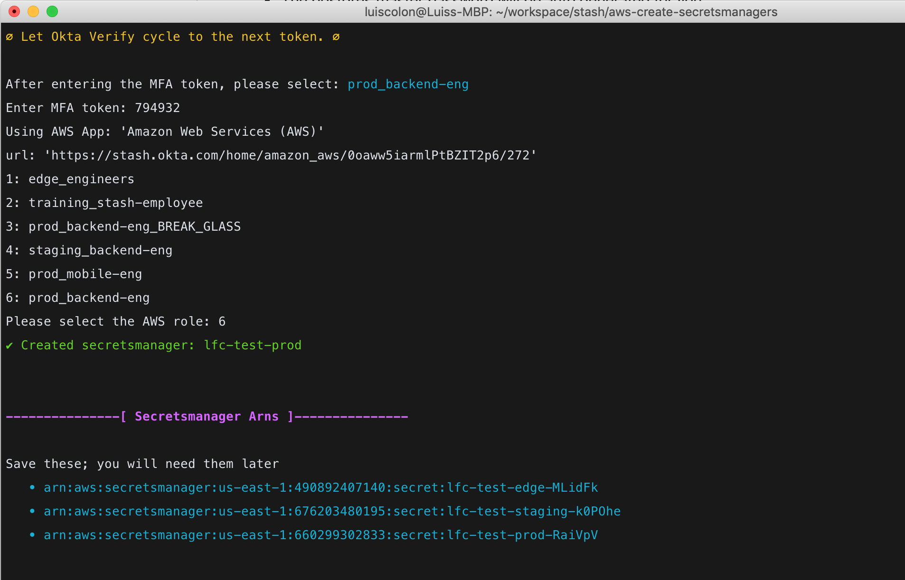

# Cipher

A shell script that will create an AWS secrets manager for your service on edge, staging, and prod.

The default set of secrets are:

```json
{
  "dbMasterUser": "postgres",
  "dbMasterPassword: "password",
  "sumologicEndpoint: ""
}
```

**Notes:**

* The postgres master password will be auto generated for you.
* The sumologic endpoint is left blank so terraform deploys will still work while you request an actual value from devops

## Requirements

[jq](https://stedolan.github.io/jq/) - a lightweight and flexible command-line JSON processor

```
brew install jq
```

You will also need to be able to run okta commands into various stash aws profiles. TBD...

## Installation 

TBD...

## Usage

You will need to have your Okta Verify app open on your phone. The script will guide you on what to do.

```
./cipher project-name
```

Follow the instructions provided. When the script is complete you will have a secretsmanager setup on edge, staging, and prod.

## Example output

